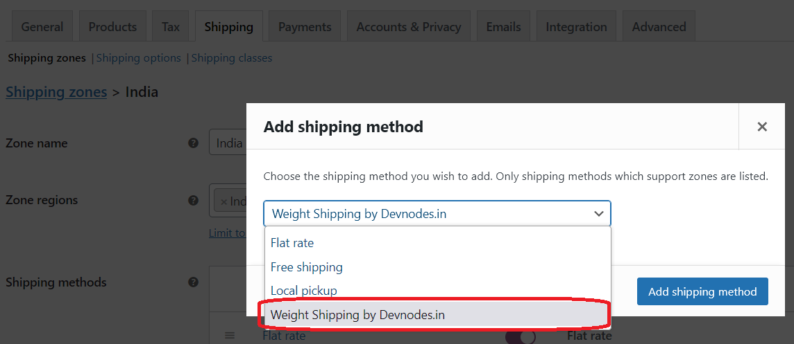
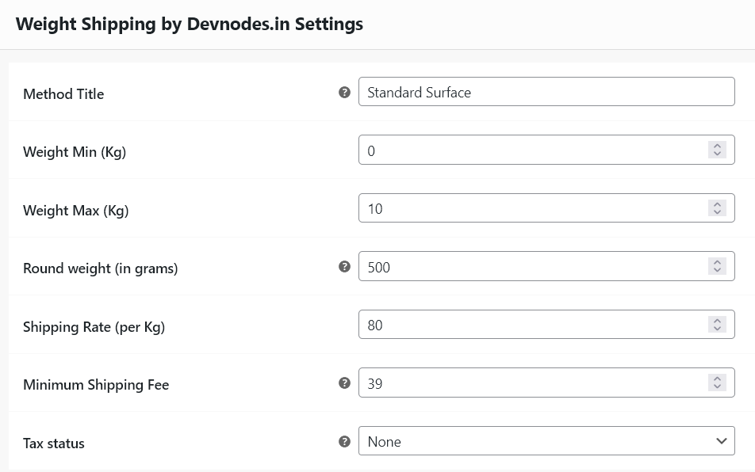

# Devnodes Weight based shipping Plugin for Woocommerce

Free Weight based shipping Plugin for Woocommerce 

This woocommerce plugin allows you to calculate shipping charge based on product weight. 

Once Installed you can find a new shipping method added in woocommerce Shipping tab

Woocommerce > Settings > Shipping > Shipping Zone (Edit) > Add shipping method

## Fast - Free - Open Source - Light

## Contact Us

You can hire us to customize or add more feature to this plugin.

You can reach via [Devnodes.in](https://devnodes.in) or [https://github.com/thalib](https://github.com/thalib)
